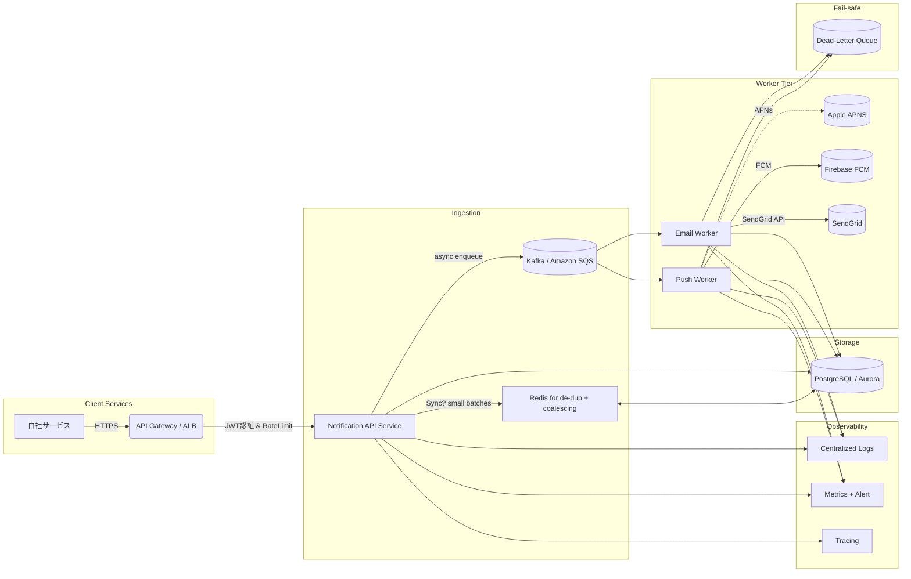

```mermaid
---
config:
  layout: dagre
---
flowchart LR
 subgraph z["Client Services"]
        GW("API Gateway / ALB")
        A["自社サービス"]
  end
 subgraph Ingestion["Ingestion"]
        Svc["Notification API Service"]
        Q[("Kafka / Amazon SQS")]
        Cache["Redis for de-dup + coalescing"]
  end
 subgraph subGraph2["Worker Tier"]
        APNS[("Apple APNS")]
        W1["Push Worker"]
        FCM[("Firebase FCM")]
        SG[("SendGrid")]
        W2["Email Worker"]
  end
 subgraph Storage["Storage"]
        DB[("PostgreSQL / Aurora")]
  end
 subgraph Observability["Observability"]
        L["Centralized Logs"]
        M["Metrics + Alert"]
        T["Tracing"]
  end
 subgraph s1["Fail-safe"]
        DLQ[("Dead-Letter Queue")]
  end
    A -- HTTPS --> GW
    GW -- JWT認証 & RateLimit --> Svc
    Svc -- async enqueue --> Q
    Svc -- Sync? small batches --> Cache
    W1 -. APNs .-> APNS
    W1 -- FCM --> FCM
    W2 -- SendGrid API --> SG
    Q --> W1 & W2
    Cache <--> DB
    Svc --> DB & L & M & T
    W1 --> DB & L & M & DLQ
    W2 --> DB & L & M & DLQ


```
