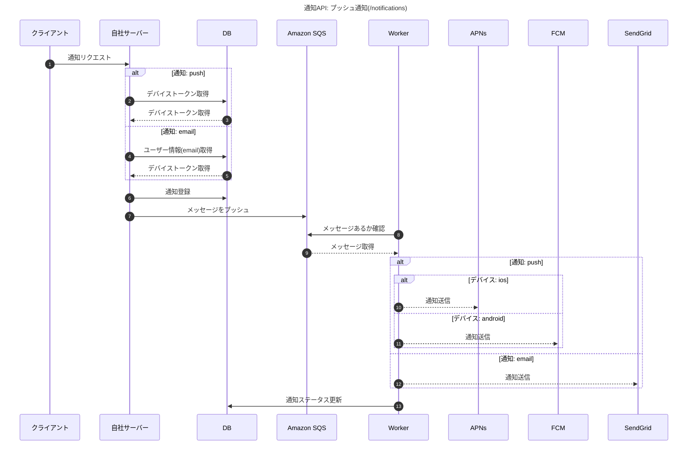

```mermaid
sequenceDiagram
    autonumber
    title 通知API: プッシュ通知(/notifications)

    participant クライアント
    participant 自社サーバー
    participant DB
    participant Amazon SQS
    participant Worker
    participant APNs
    participant FCM
    participant SendGrid
    クライアント->>自社サーバー: 通知リクエスト
    alt 通知: push
        自社サーバー->>DB: デバイストークン取得
        DB-->>自社サーバー: デバイストークン取得
    else 通知: email
        自社サーバー->>DB: ユーザー情報(email)取得
        DB-->>自社サーバー: デバイストークン取得
    end
    自社サーバー->>DB: 通知登録
    自社サーバー->>Amazon SQS: メッセージをプッシュ
    Worker->>Amazon SQS: メッセージあるか確認
    Amazon SQS-->>Worker: メッセージ取得
    alt 通知: push
        alt デバイス: ios
            Worker -->> APNs: 通知送信
        else デバイス: android
            Worker -->> FCM: 通知送信
        end
        
    else 通知: email
        Worker -->> SendGrid: 通知送信
    end
    Worker->>DB: 通知ステータス更新
```
